## Advanced Lane Lines Project

The goals of this project are to:

* Display lane boundaries on the video feed  from dash mounted camera. 
* Estimate road curvature and vehicle position on the lane. 

The steps taken to achive these goals were:

* Compute the camera calibration matrix and distortion coefficients given a set of chessboard images.
* Apply a distortion correction to raw images.
* Use color transforms, gradients, etc., to create a thresholded binary image.
* Apply a perspective transform to rectify binary image ("birds-eye view").
* Detect lane pixels and fit to find the lane boundary.
* Determine the curvature of the lane and vehicle position with respect to center.
* Warp the detected lane boundaries back onto the original image.
* Output visual display of the lane boundaries and numerical estimation of lane curvature and vehicle position.

[//]: # (Image References)

[image1]: ./examples/undistort_output.png "Undistorted"
[image2]: ./test_images/test1.jpg "Road Transformed"
[image3]: ./examples/binary_combo_example.jpg "Binary Example"
[image4]: ./examples/warped_straight_lines.jpg "Warp Example"
[image5]: ./examples/color_fit_lines.jpg "Fit Visual"
[image6]: ./examples/example_output.jpg "Output"
[image_calibration]: ./examples/calibration2_composite.jpg "Calibration result"
[image_distortion]: ./examples/sample_distortion.png "Distortion removal"
[image_binarized]: ./examples/sample_binarized.png "Binarized"
[image_mask]: ./examples/sample_mask.jpg "Mask"
[image_lines]: ./examples/sample_lines.png "Mask"
[image_topview]: ./examples/sample_topview.png "Top view"
[image_interior]: ./examples/sample_interior.png "Interior view from top view"
[image_lane]: ./examples/sample_lane.png "Final result"
[video1]: ./output_videos/project_video.mp4 "Video"

## Final result

## Implementation details

### Camera Calibration

The code for this step is contained in the python file "camera_calibration.py".

I start by preparing "object points", which will be the (x, y,z) coordinates of the chessboard corners in the world. Here I am assuming the chessboard is fixed on the (x, y) plane at z=0, such that the object points are the same for each calibration image.  Thus, `objp` is just a replicated array of coordinates, and `objpoints` will be appended with a copy of it every time I successfully detect all chessboard corners in a test image.  `imgpoints` will be appended with the (x, y) pixel position of each of the corners in the image plane with each successful chessboard detection.  

I then used the output `objpoints` and `imgpoints` to compute the camera calibration and distortion coefficients using the `cv2.calibrateCamera()` function.  I applied this distortion correction to the test image using the `cv2.undistort()` function and obtained this result: 

![alt text][image_calibration]

These camera calibration coefficients are saved to be used in all subsequent images to be processed.

### Pipeline (single images)

#### 1. Distortion correction

Distortion correction is applied in cell 2 of the 'Lane_Detection.ipynb' jupyter notebook, using 'cv2.undistort()' with the coefficients saved in the previous step. This is the result applying it to an image:
![alt text][image_distortion]

#### 2. Thresholded binary image

This step is implemented in cell 4 of the jupyter notebook. I used a combination of color and gradient thresholds to generate a binary image.

Images were transformed to an Luv colorspace, and different thresholds applied to separate whites and yellows:

* All three channels were used to isolate whites. High values in the L channel (>210) combined with mid-tones in the u and v channel are the selected approach.
* For the yellows, high values in the **v** channel are the main indicator. Combining this with mid values in the u_channel provide a clearer frame.

The final binarized image for some test images can be seen below:
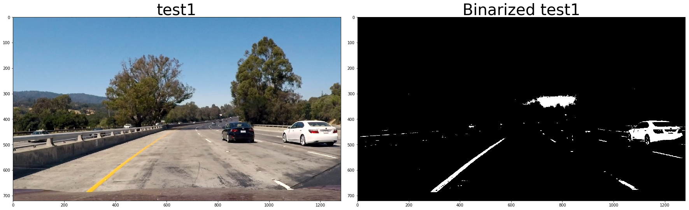
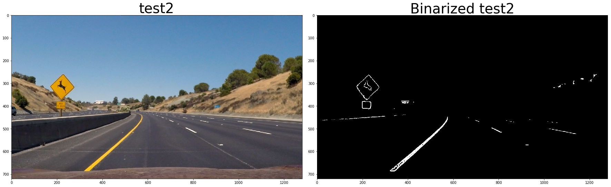
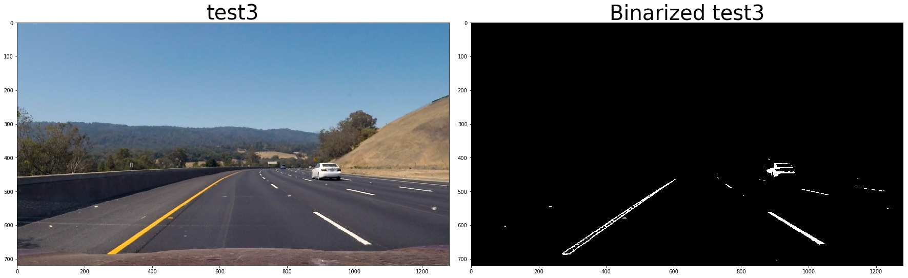
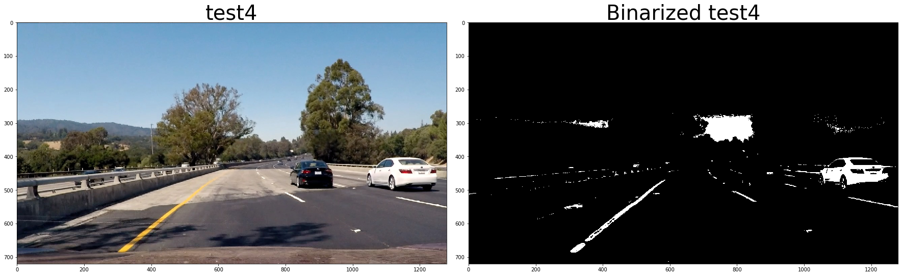
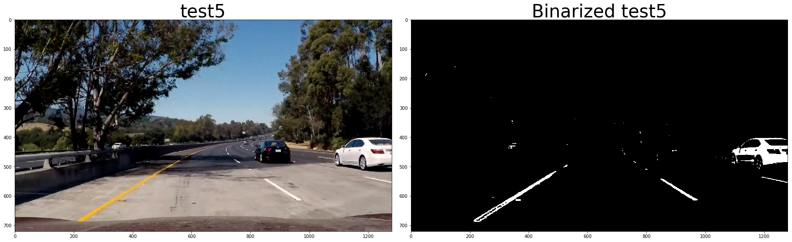
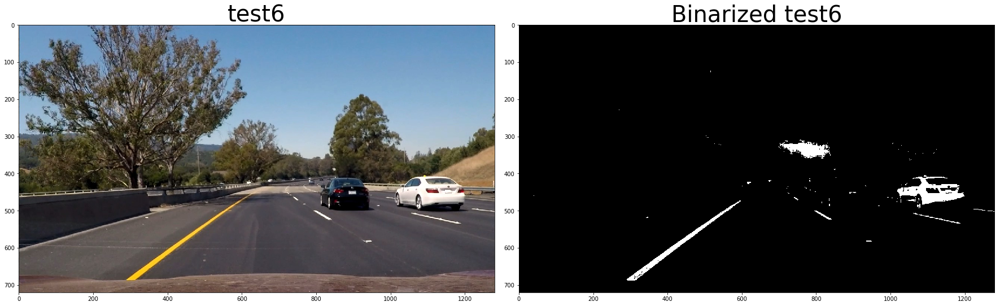

#### 3. Perspective transform

The code for my perspective transform is in cell 3 of the jupyter notebook.   The `warper()` function takes as inputs an image (`img`), as well as source (`src`) and destination (`dst`) points.  I chose the  following source and destination points:

| Source        | Destination   | 
|:-------------:|:-------------:| 
| 240, 695      | 330, 720        | 
| 595, 450      | 330, 50      |
| 1070, 695     | 950, 720      |
| 685, 450      | 950, 50        |

These numbers were chosen to be symmetrical in the transformed perspective, 330pixels apart from the edges of the frame. I verified that my perspective transform was working as expected by drawing the `src` and `dst` points onto a test image and its warped counterpart to verify that the lines appear parallel in the warped image.

![alt text][image_lines]

#### 4. Lane-lines: pixel identification and polynomial fit

Using the undistorted image with perspective correction and binarization applied , lane line pixels were identified and a 2nd order polynomial was fit to those pixel positions. This was done for every frame, but then some sanity checks were applied, and if the newly fitted curves were not considered good enough, the previous ones were kept (cell 8). 

For the first frame, and if the last acceptable curves are older than 5 frames,  a 'blind' search with the sliding windows algorithm (cell 6 in the notebook) is used. 

For frames with a recent reference, the previous fitted lines were used as a starting point, and pixels were identified in its immediate surroundings (cell 7 in the notebook). 

The sanity checks performed to the curves (in cell 9) include the following:

* Residual of the polynomial fit
* Both lane lines curving in the same direction (unless they are almost straight)
* Lane width is about right at different points in the frame. 
* Lanes are in a similar position to the last known 'good curve' at different points in the frame.

Here are some frames showing the kind of situations these checks avoid. The 'last good' lane is painted green and the one being discarded is painted red. So for example in this frame, the right lane curving outwards in red is part of the discarded curves
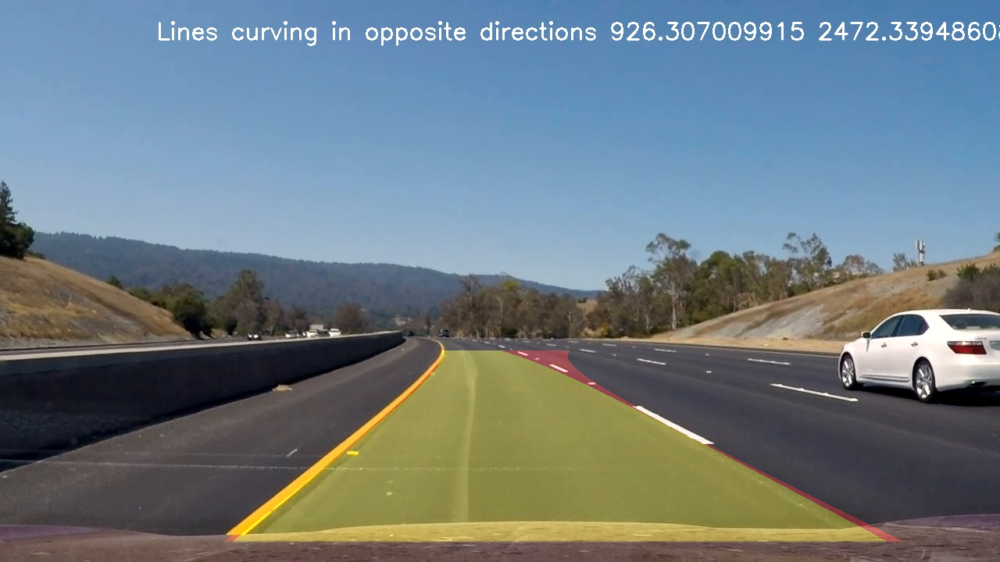
The same but on the left lane
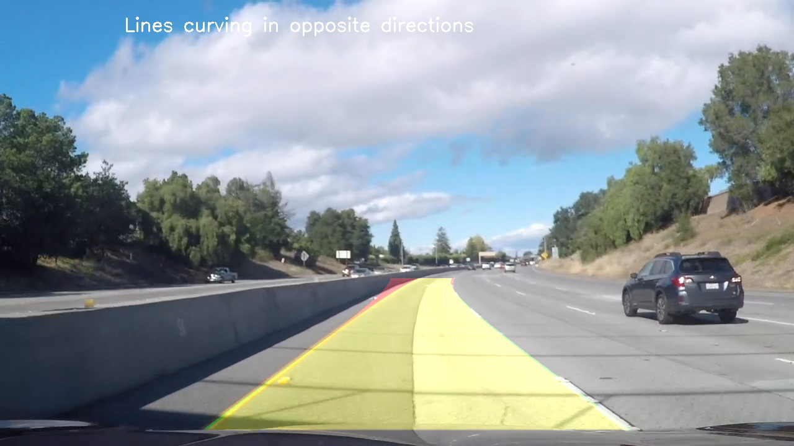
Distance check:
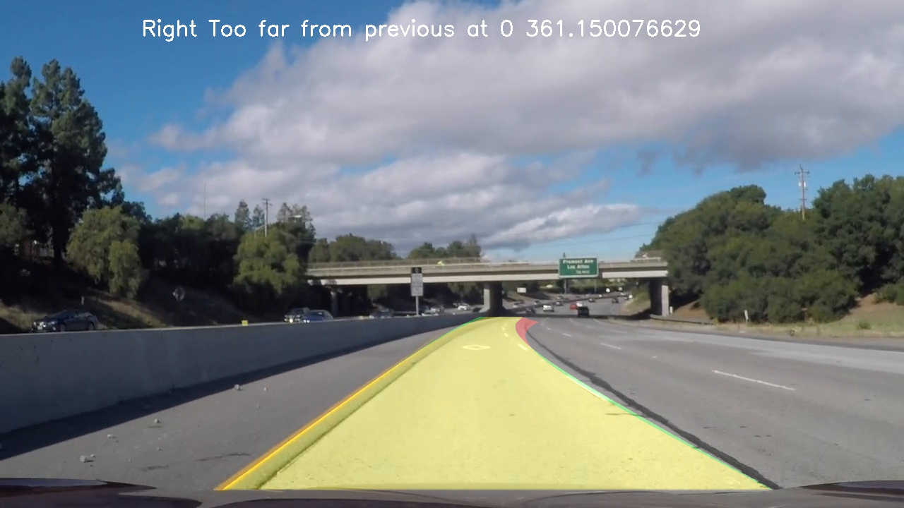
Another distance check, this one illustrating that different thresholds should be used at different points in the frame, as 160 pixels at position 0 in the warped image represent a small change in the final image. The thresholds are now different for each point (300 for this position)
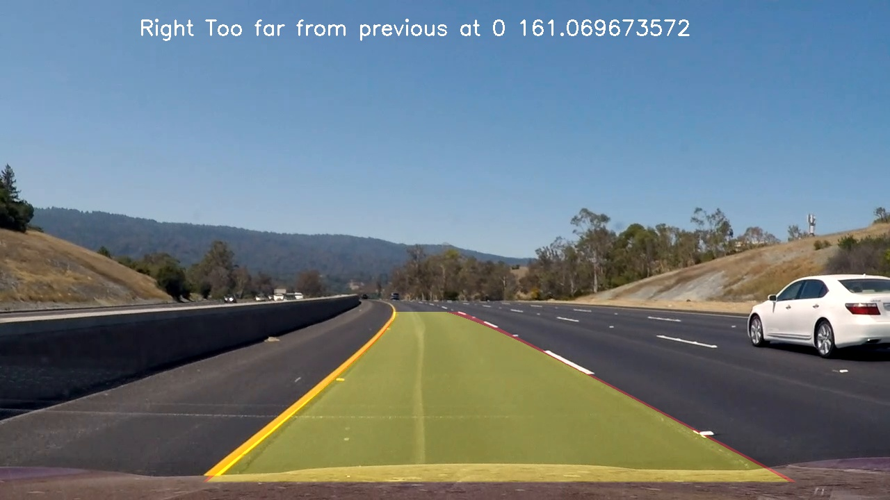

Now two lane widths checks failing, one too wide,
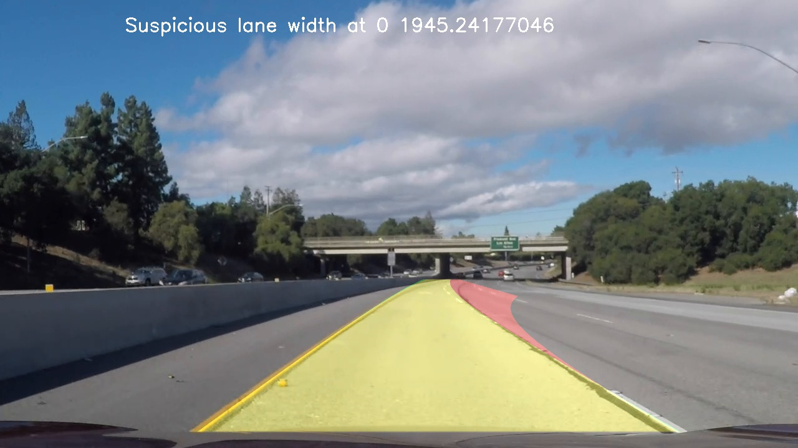
the other too narrow
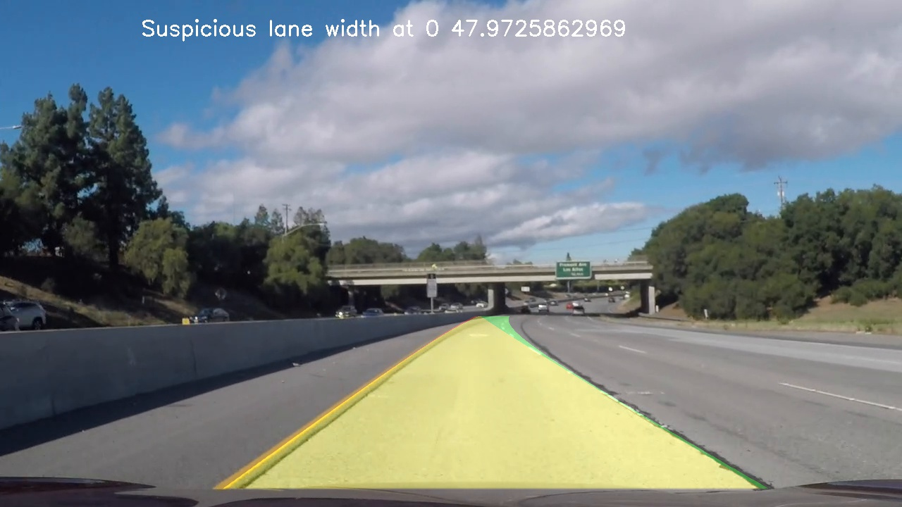

Checks to ensure a similar curvature of left-right and current-previous lines were tested, but discarded, as many frames with significantly different curvatures visually had a good fit. See for example this one with right curvature changing from 970 to 2000 m, with no discernible impact on the actual lane:
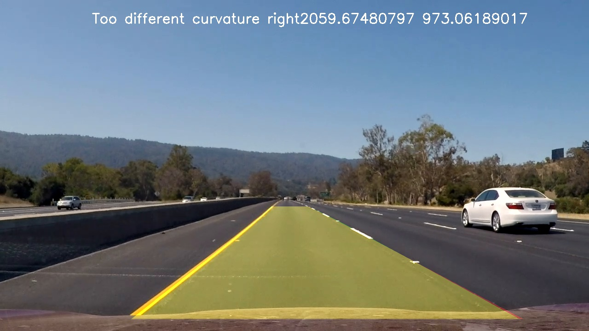
Or this one, with left lane identified as a curve, and right lane as a straight, again with good fit. 
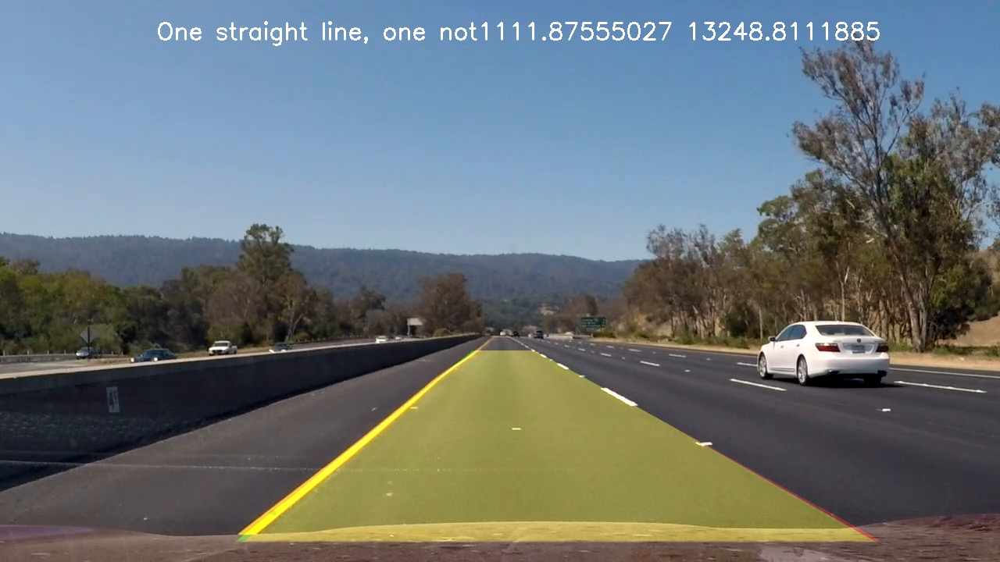

#### 5. Estimation of lane curvature and the position of the vehicle with respect to center.

Done in cell 12 from the jupyter notebook. Calculations were done assuming a lane width of 3.7 meters, and that 30 meters of the road are visible in the top view image. Curve radius was estimated at the bottom of the image (in the car position), calculating the curvature of both lanes, and taking the mean value. The position of the car was estimated comparing the center of the lane to the center of the image (which is assumed to correspon to the center of the car).

Considering the road curvature radius wont change rapidly, exponential smoothing was used to avoid changes from frame to frame.

Additionally, the resulting values were interpreted in function 'curvature_and_position_text' in cell 13:

* Curvature values over 10Km were shown as '>10Km', as exact values when not in a curve are not really representative. 
* Position values from 5cm left to 5cm right of the center of the lane are reported as 'Around lane center', to avoid quickly changing from left to right of the lane.

#### 6. Final overlay.

Function 'draw_lane' in cell 9 of the notebook takes the image and the fitted lane lines and paints the lane area in green. It also writes a text to the top of the image, in this case, the curvature and position of the vehicule. Here is an example of my result on a test image:

![alt text][image_lane]

Here's a [link to my video result](./output_videos/project_video.mp4).

### Discussion - Harder videos

The pipeline was also ran on the challenge videos, with varying results. In the first challenge video ([see here](./output_videos/challenge_video.mp4)), there's a point were the lane goes clearly off-road, but overall the result is not too bad, and would've probably kept the car in the road.
The 'harder challenge', however, was certainly too much to handle, as can be seeen [here](./output_videos/challenge_video.mp4). The lane is updated very rarely, as most of the time it's not possible to identify the lines. There are several issues the pipeline was not designed to handle:

* Lightning conditions:  there are many frames with lots of light, overblown hightlights, and lots of shaded areas, as well as a windshield reflection.
* Right line: The right line is at the edge of the road for much of the video, in one occasion it's even covered with leaves.
* Sharp turns: The turns are much sharper in this video. 

I made an attempt to improve the process for the latter condition, sharp turns. These turns result in lines that exit the warped image from the sides of the frame. Also, the warped image might contain extraneous hot pixels that might confuse the polynomial fit:
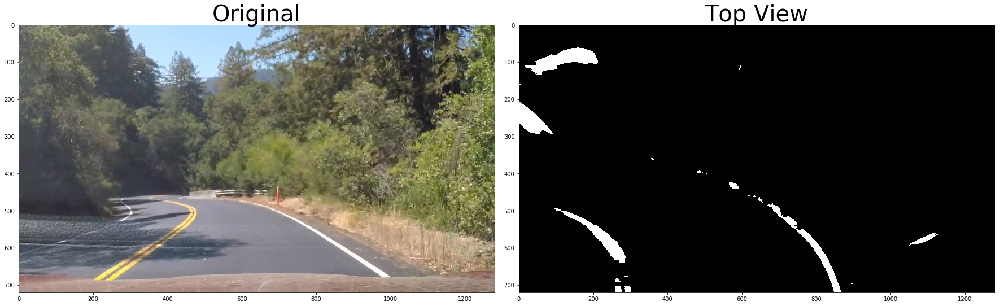
The binarized image appear to be quite OK:
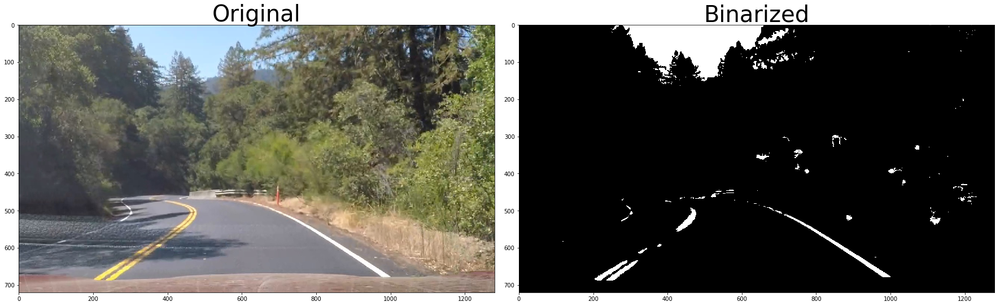
But applying the perspective tranformation augmentates a small portion of the side of the road:
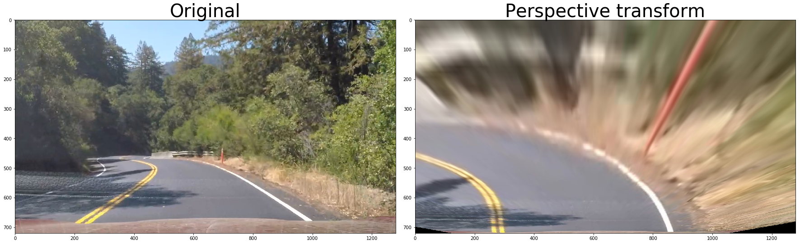

I changed the sliding windows algorithm so it stops looking for additional pixels up the frame, when the window is moving to the side, and reach the end of the frame. Additionally, the "external lane" is pushed towards the side even if no pixels are found (see cell 6). This is a representation of the process:
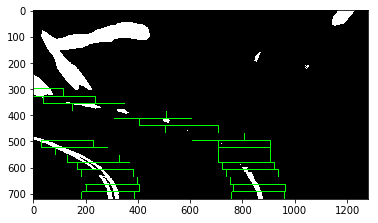
The algorith would regularly keep going up, and use all those white pixels to fit a curve.

This approach seems to help in cases such as the one depicted, going from this:
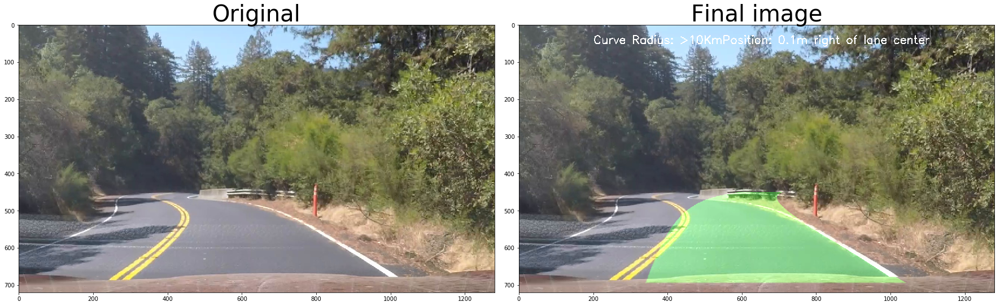
to this:
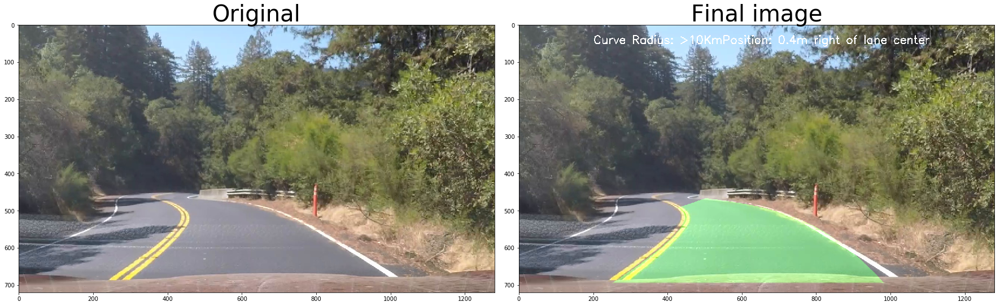

But in the end, it's not enough to even barely find the lines in this video. 

If I were to keep working on this, I think I'd try some pre-processing of the image, or different binarization approaches based on the luminosity of the frame. Also, right now I'm only looking for white and yellow lines, and that might not be enough when the line if other color, of course, but also when there is no line, but just an edge, because the line is not visible, or non-existent.
Also, I might try to work with both lines independently, as one of them might not be visible (e.g. second 42 in the 'harder_challenge' video).

---

This project was completed for the Udacity Self Driving Car Nanodegree 
